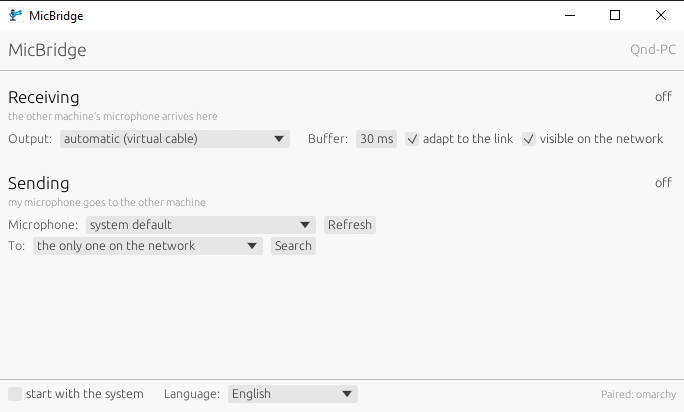

# MicBridge

**One computer's microphone, on another computer.** Run it on both machines
over your home network and the microphone shows up on the second one as an
ordinary input device — Discord, OBS, a game or a browser see it like any
other microphone.

Linux ↔ Windows, either direction. No account, no server, no cloud.

[](https://github.com/quendae/MicBridge/actions/workflows/ci.yml)
[](https://github.com/quendae/MicBridge/releases/latest)
[](#licence)

<br clear="left">



---

## Install

| System | How |
|---|---|
| **Windows** | [`MicBridge-*-x64.msi`](https://github.com/quendae/MicBridge/releases/latest) |
| **Debian, Ubuntu** | `sudo apt install ./micbridge_*.deb` |
| **Fedora, openSUSE** | `sudo dnf install ./micbridge-*.rpm` |
| **Arch and friends** | `makepkg -si` in `packaging/arch` |

Every package carries both programs: the window, `micbridge-gui`, and the
command line, `micbridge`.

Then ask the machine whether it is ready:

```
micbridge doctor
```

It answers for the two roles separately, because they need different things.
**Sending** needs nothing but a microphone. **Receiving** needs somewhere to
put someone else's audio so that it looks like a microphone — free on Linux,
one extra install on Windows (see [Where the audio lands](#where-the-audio-lands)).

## Use

Open the window and flip a switch. The two halves are independent, and turning
both on is fine: one machine can hand over its own microphone and take somebody
else's at the same time.

**The first connection asks for a code.** The receiving machine shows six
digits, the sending machine asks you to type them in. That is the only manual
step there ever is; from then on the two find each other on their own.

Both halves show **latency and loss**, as numbers and as a two-minute graph.
The sender cannot measure latency by itself, so it displays the figure the
receiver reports — both ends look at the same number.

Closing the window hides the program in the system tray rather than stopping
it: a session can play for hours, and closing a window is not a request to cut
it off. Quit lives in the tray icon's menu.

The command line does exactly the same job, on the same engine:

```bash
# what the system can see
micbridge devices

# the receiver — start this one FIRST; it listens and announces itself
micbridge recv --sink auto

# the sender — no address needed, it finds the receiver on the network
micbridge send --device "yeti"
```

If more than one receiver is on the network, the sender lists them and asks you
to pick: `--to "living room"` or `--to 192.168.1.40`.

| Flag | For |
|---|---|
| `send --bitrate 32000` | more bits, when 24 kbps is not enough |
| `send --gain-db 6` | a quiet microphone |
| `send --code 482193` | the pairing code up front — for scripts and services |
| `recv --fixed-buffer` | hold the given cushion instead of adapting it to the link |
| `recv --no-announce` | stay off mDNS; the address is then given by hand |
| `discover` | which receivers are visible on the network |
| `peers` / `forget <name>` | what is paired, and how to undo it |

Your devices do not have to run at 48 kHz — whichever side needs it resamples.

## Where the audio lands

This is the one place where the two systems genuinely differ.

| `--sink` | Linux | Windows |
|---|---|---|
| `auto` (default) | creates a "MicBridge" microphone in PipeWire | finds a virtual cable by name |
| `virtual` | the same, forced | refused at startup |
| `device`, or part of a name | an ordinary output device | an ordinary output device |

On **Linux** there is nothing to install. The process introduces itself to the
PipeWire graph as an audio source and appears in microphone lists as
"MicBridge".

On **Windows** a program cannot create an input device without a signed
kernel-mode driver, so it borrows one: install
[VB-CABLE](https://vb-audio.com/Cable/) once. MicBridge writes to `CABLE Input`
and your application picks `CABLE Output` as its microphone. Afterwards, open
`VBCABLE_ControlPanel.exe` and set **Max Latency** to 2048 samples — the
default of 7168 adds about 130 ms, more than the rest of the chain put
together.

## Language

MicBridge speaks Polish, English, German, Spanish, French, Italian and
Ukrainian, and picks one from your system settings; anything it does not
recognise gets English. When the guess is wrong — an English system belonging
to someone who would rather read Polish — the picker at the bottom of the
window overrides it. The choice is remembered next to the pairing keys and
takes effect immediately.

`MICBRIDGE_LANG=de micbridge doctor` overrides both, for one run.

## Ports

TCP 47100 for control, UDP 47101 for audio, UDP 5353 for finding each other.
Only the **receiving** machine needs them open; sending needs nothing.

## Security

A home network is not a trusted place — being on the same Wi-Fi is enough to
join it. So:

* **Pairing happens once, with a code from the screen.** Six digits are far too
  few for a key, but SPAKE2 gives an eavesdropper nothing to attack offline:
  recording the whole exchange does not let them guess at leisure. They have to
  be right the first time, live — and after three misses the receiver draws a
  new code.
* **Every session has its own keys.** The shared secret from pairing only
  authenticates; the actual keys come from a Noise `NNpsk0` handshake on each
  connection. Recorded traffic stays unreadable even to someone who later gets
  hold of the key file.
* **Audio is encrypted and authenticated,** each packet on its own, because
  over UDP they get lost and reordered. The RTP header stays in the clear — the
  jitter buffer has to read it before anything can be decrypted — but it is
  covered by the authentication tag, so altering a sequence number invalidates
  the packet.
* **Machine names prove nothing.** They only look up a key; taking someone
  else's name gains an attacker nothing, because it does not hand them the key.

Keys live in `peers.toml` in your user configuration directory
(`micbridge peers` prints the path), mode `600` on Linux.

What this does *not* protect against: nobody checks that the machine you paired
with is the one you had in mind. A person copies a code off the screen in front
of them, and that is the whole of the identity check.

## When something is off

| Symptom | What to look at |
|---|---|
| No "MicBridge" in the microphone list | The node appears with the session — is the sender connected? Applications that listed devices earlier need to refresh. |
| `cannot create the virtual microphone` | `systemctl --user status pipewire pipewire-pulse wireplumber` |
| Crackling, `UNDERRUN` in the log | Raise the cushion: `recv --buffer-ms 60` |
| The sender cannot see the microphone | `micbridge devices`, then `--device "<part of the name>"` |
| The two machines cannot find each other | Some Wi-Fi routers block multicast between clients. Give the address directly: `send --to 192.168.1.40` |

`--device tone` sends a 440 Hz sine instead of a microphone, which exercises
the whole path — framing, network, buffer, sink — on a machine that has no
microphone at all.

More logging: `-v` for debug, `-vv` for trace, on any command.

## Building from source

Rust 1.85 or newer.

```bash
cargo build --release --workspace
```

System packages you will need first:

```bash
# Debian / Ubuntu
sudo apt install build-essential cmake pkg-config libasound2-dev \
     libpipewire-0.3-dev libclang-dev libgtk-3-dev \
     libayatana-appindicator3-dev libxkbcommon-dev

# Fedora
sudo dnf install gcc-c++ cmake alsa-lib-devel pipewire-devel clang-devel \
     gtk3-devel libappindicator-gtk3-devel libxkbcommon-devel

# Arch
sudo pacman -S base-devel cmake clang alsa-lib pipewire gtk3 \
     libayatana-appindicator libxkbcommon
```

On Windows the MSVC toolchain plus CMake is enough; everything else comes from
crates.

```
crates/mb-proto/    RTP framing, CBOR control messages, sequence-number extension
crates/mb-audio/    device enumeration and streams over WASAPI / ALSA / PipeWire
crates/mb-engine/   codec, jitter buffer, drift controller, resampler
crates/mb-net/      discovery, pairing, encryption
crates/mb-i18n/     every user-visible string, in one table
crates/mb-app/      sessions and the command line
crates/mb-gui/      the window
```

Adding a language means adding one column to
`crates/mb-i18n/src/catalog.rs`. Leaving a string out will not compile.

Design notes, in Polish: **[docs/ARCHITEKTURA.md](docs/ARCHITEKTURA.md)**.

## Licence

MIT or Apache-2.0, at your option — [LICENSE-MIT](LICENSE-MIT),
[LICENSE-APACHE](LICENSE-APACHE).
