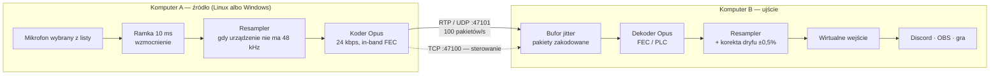
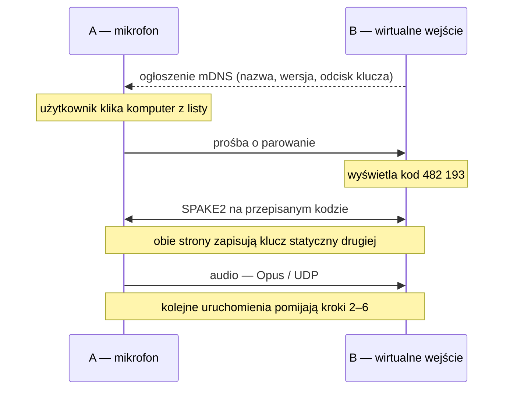

# MicBridge — założenia i architektura

Wersja 2.0 · wrzesień 2026

Wersja tego dokumentu do czytania w przeglądarce, z diagramami:
[dokument techniczny](https://claude.ai/code/artifact/c6f3e44a-ac5e-4cda-8299-fce46b05237f).

---

## 1. Zakres: prostota jest specyfikacją

Projekt ma jeden nadrzędny wymóg i nie jest nim jakość dźwięku ani opóźnienie.
Jest nim to, że osoba nietechniczna instaluje program na dwóch komputerach
w domu i po minucie mówi do mikrofonu. Każda decyzja poniżej jest
podporządkowana temu zdaniu — łącznie z decyzjami o tym, czego **nie**
budujemy.

### W zakresie

- Jeden plik wykonywalny na system, obsługujący **obie role**: nadawanie
  mikrofonu i odbieranie go. Kierunek Linux → Windows i Windows → Linux to ta
  sama ścieżka kodu, tak samo jak Linux → Linux.
- **Automatyczne wykrywanie w sieci lokalnej.** Użytkownik nie wpisuje adresu
  IP, nie otwiera portów, nie zakłada konta.
- Wybór źródła po stronie nadającej — z nazwami takimi, jakie widać
  w ustawieniach dźwięku systemu, nie z indeksami ALSA.
- Utworzenie urządzenia wejściowego po stronie odbierającej, tak by Discord,
  OBS, komunikator czy gra zobaczyły je na swojej liście mikrofonów.
- Pakiety dla trzech rodzin dystrybucji plus uniwersalny fallback, oraz
  instalator MSI dla Windows.

### Poza zakresem — świadomie

- **Praca przez internet, relay, przebijanie NAT.** Przy łączu przez internet
  samo opóźnienie sieci zjada więcej niż cały budżet z §7, a projekt przestaje
  się bronić. Kto naprawdę tego potrzebuje, postawi Tailscale lub WireGuard
  i wpisze adres ręcznie — MicBridge wtedy zadziała, bo dla niego tunel to
  zwykły interfejs, ale nie budujemy pod to niczego i nie obiecujemy.
- **Wiele strumieni, miksowanie, routing.** Jedno źródło, jedno ujście, jedna
  para. VoiceMeeter już istnieje.
- **Własny sterownik audio dla Windows.** Powody w §4 — to jedyne miejsce,
  w którym prostota instalacji przegrywa z rzeczywistością, i trzeba o tym
  powiedzieć wprost zamiast udawać.

Moonlight i Sunshine były pierwotnym pretekstem, ale program jest od nich
niezależny i nic o nich nie wie.

---

## 2. Łańcuch sygnału



Cały łańcuch jest symetryczny poza jednym miejscem: sposobem, w jaki system
operacyjny odbiorcy pozwala utworzyć urządzenie wejściowe.

---

## 3. Zestawienie połączenia

Wykrywanie opiera się na **mDNS / DNS-SD** — tym samym mechanizmem, którym
drukarki i głośniki ogłaszają się w sieci domowej. Strona odbierająca publikuje
usługę `_micbridge._udp.local`, strona nadająca ją widzi. Router nie musi nic
wiedzieć, użytkownik nie musi znać żadnego adresu.

Kluczowy wybór biblioteki: **`mdns-sd`**, czysty Rust z własnym stosem.
Popularniejszy crate `zeroconf` deleguje do Avahi na Linuksie i Bonjour na
Windows — czyli wymagałby od użytkownika Windows doinstalowania usługi Apple'a.
To jedna zależność za dużo dla programu, którego całą obietnicą jest
„zainstaluj i działa”.

Parowanie odbywa się **raz**:



Kod jest krótki, bo SPAKE2 nie pozwala go zgadywać offline — trzy nieudane
próby i odbiornik generuje nowy. Od kolejnego uruchomienia strony łączą się
same, przez Noise `KK` na zapamiętanych kluczach.

### Gdy mDNS nie przechodzi

Część routerów Wi-Fi blokuje ruch multicast między klientami (izolacja AP),
a sieci firmowe dzielą LAN na segmenty. Lista wykrytych komputerów ma wtedy na
końcu pozycję *„Wpisz adres ręcznie…”* — jedno pole, jeden port domyślny. To
jest cała droga awaryjna i wystarczy.

---

## 4. Wirtualne wejście: jedyne miejsce, gdzie robi się trudno

Odbieranie i dekodowanie dźwięku to rzemiosło. Cała trudność projektu siedzi
w jednym zdaniu: aplikacja musi zobaczyć *urządzenie wejściowe*, a nie gniazdo
sieciowe.

### Linux — za darmo

PipeWire pozwala programowi utworzyć własny node ze strumieniem wyjściowym typu
*source*. Nasz proces zgłasza się jako źródło dźwięku i natychmiast pojawia się
w `pavucontrol` oraz na listach mikrofonów w Discordzie i OBS-ie — pod nazwą,
którą sami nadamy. Dla starszych systemów z czystym PulseAudio ta sama sztuczka
wymaga `module-null-sink` plus `module-remap-source`, ładowanych przez program
i sprzątanych przy wyjściu. Zero instalacji dodatkowych rzeczy.

### Windows — tu trzeba coś doinstalować

Windows nie ma odpowiednika tego mechanizmu. Utworzenie urządzenia audio wymaga
sterownika trybu jądra, a każdy sterownik od Windows 10 musi być podpisany
certyfikatem EV i przejść atestację WHQL. To kilka tysięcy złotych rocznie,
cykl wydawniczy w tygodniach i realne ryzyko, że anti-cheat którejś gry uzna
nasz świeży sterownik za coś podejrzanego.

| Ścieżka | Co daje | Koszt | Ocena |
|---|---|---|---|
| **VB-CABLE** | Gotowa para render/capture. Piszemy do `CABLE Input`, aplikacja wybiera `CABLE Output`. | Jednorazowy instalator, donationware. Nie wolno go dołączyć do naszego pakietu bez zgody autora. | **wybrane** |
| VoiceMeeter | To samo plus mikser — sensowne, jeśli użytkownik i tak go ma. | Cięższy, zmienia domyślne urządzenia systemu. | wykrywane |
| Virtual Audio Cable | Dojrzały, niskie opóźnienia, wiele linii. | Płatny per stanowisko. | wykrywane |
| Własny sterownik | Instalacja jednym kliknięciem, własna nazwa urządzenia. | Certyfikat EV, WHQL, ryzyko z anti-cheatem, utrzymanie przy każdej dużej aktualizacji Windows. | odrzucone |

**Decyzja: nie dostarczamy sterownika — dostarczamy bezbolesne dojście do
cudzego.** Instalator sprawdza, czy któryś ze znanych kabli jest obecny; jeśli
nie, pokazuje jeden ekran z wyjaśnieniem w dwóch zdaniach i przyciskiem
otwierającym oficjalną stronę VB-CABLE. Program sam wybiera właściwe urządzenie
renderujące po nazwie i nadaje mu w interfejsie etykietę „MicBridge”, żeby
użytkownik nie musiał kojarzyć, że „CABLE Output” to jego mikrofon.

> **Jeden suwak wart więcej niż tydzień optymalizacji.**
> `VBCABLE_ControlPanel.exe` ma parametr *Max Latency* domyślnie ustawiony na
> 7168 sampli — 149 ms zbędnego buforowania. Zejście do 2048 (43 ms) to
> największy pojedynczy zysk w całym systemie. Instalator powinien to odczytać
> i, jeśli jest źle, powiedzieć o tym wprost, z instrukcją w trzech krokach.

---

## 5. Stos technologiczny

Kryteria wynikają wprost z §1: jeden zestaw źródeł na oba systemy, brak pauz
odśmiecacza w wątku audio, statyczne binaria bez runtime'u do doinstalowania,
i — to okazało się najważniejsze — **zero zależności od usług systemowych,
które użytkownik musiałby sam włączyć**.

| Warstwa | Wybór | Uzasadnienie |
|---|---|---|
| Język | Rust | Cross-kompilacja jednym poleceniem, brak GC w ścieżce czasu rzeczywistego, dojrzałe wiązania do libopus. |
| Wykrywanie | `mdns-sd` | Czysty Rust. `zeroconf` wymaga Avahi lub Bonjour — czyli usługi Apple'a w Windows. |
| I/O audio | `cpal` | Jedno API nad WASAPI i ALSA, enumeracja urządzeń, callback o wysokim priorytecie. |
| Linux — źródła i node | `pipewire-rs` | Nazwy jak w `pavucontrol`, dostęp do źródeł `.monitor`, a po stronie odbiorczej tworzenie wirtualnego mikrofonu. |
| Kodek | `opus` (libopus) | Ramki 10 ms, in-band FEC, DTX, PLC. |
| Resampling | `rubato` | Asynchroniczny SINC z płynnie zmienialnym współczynnikiem — potrzebny do korekcji dryfu. |
| Bufory | `ringbuf` | SPSC bez blokad między callbackiem audio a wątkiem sieciowym. |
| Sieć | `std::net`, docelowo `tokio` | UDP na media, TCP na sterowanie. |
| Parowanie | `spake2` + `snow` | SPAKE2 zamienia sześć cyfr na pełnowartościowy sekret; Noise `KK` obsługuje kolejne sesje bez udziału użytkownika. |
| Interfejs | `eframe` / egui | Jedno okno, jeden statycznie linkowany plik. Tauri ciągnie `webkit2gtk`, czego przy tak małym oknie nie da się obronić. |

### Podział repozytorium

```
crates/mb-proto/    ramkowanie RTP, sterowanie CBOR, rozszerzanie numeru sekwencji
crates/mb-audio/    enumeracja i strumienie nad WASAPI / ALSA
crates/mb-engine/   kodek, bufor jitter, regulator dryfu, resampler, symulator sieci
crates/mb-app/      CLI; okno egui dochodzi w M4
```

`mb-engine` nie wie nic o systemie operacyjnym i jest w całości testowalny bez
karty dźwiękowej: podajemy mu syntetyczny strumień pakietów o zadanym rozkładzie
opóźnień i strat, dostajemy próbki. Testy dryfu odpalamy z zegarem
przyspieszonym tysiąckrotnie — ośmiogodzinna sesja mieści się w sekundzie.

---

## 6. Protokół

Ramkowanie mediów jest **zgodne z RTP** (payload type 111 = Opus/48000) i nie
jest to ozdobnik: dzięki temu strumień da się podejrzeć Wiresharkiem z pełnym
dekodowaniem i porównać z zachowaniem WebRTC, gdy coś zacznie trzeszczeć.

```
nagłówek RTP — 12 B, jawny
 0        1        2        3        4        5        6        7        8...11
+--------+--------+-----------------+---------------------------+-----------+
|V=2 P X |M  PT   |       seq       |  timestamp (1/48000 s)    |   SSRC    |
+--------+--------+-----------------+---------------------------+-----------+

cały datagram — typowo 88 B
+------------+---------------------------------+--------------+
| nagłówek   | ramka Opus 10 ms, 30–60 B       | tag AEAD     |
| 12 B       | (niesie kopię LBRR poprzedniej) | 16 B         |
+------------+---------------------------------+--------------+
             |<--- ChaCha20-Poly1305, nonce = SSRC ‖ ROC ‖ seq -->|
```

Nagłówek zostaje jawny, szyfrowany jest ładunek — jak w SRTP, tylko
nowocześniejszym szyfrem. Jawny nagłówek kosztuje zero prywatności treści,
a zwraca możliwość diagnozy standardowymi narzędziami.

Kanał sterujący: TCP 47100, ramki z prefiksem długości, ładunek w CBOR.

```
HELLO   { ver, payload, sample_rate, channels, frame_ms, device, host }
ACCEPT  { ver, ssrc, media_port, sink, host }
REJECT  { reason }
STATS   { lost_pct, jitter_ms, buffer_ms, late_pct }   // co sekundę, B → A
MUTE    { on }                                          // działa z obu stron
BYE     { reason }
```

Utrata kanału TCP unieważnia sesję i zatrzymuje media — nie ma stanu „gramy
dalej po ciemku”.

**Uwaga o etapie:** szyfrowanie i parowanie należą do M4. Do tego czasu ładunek
idzie otwartym tekstem, a `HELLO` nikt nie uwierzytelnia.

---

## 7. Budżet opóźnienia

Cel to rozmowa, nie odsłuch monitorowy: poniżej ~100 ms wymiana zdań jest
naturalna, poniżej 150 ms akceptowalna. Rozkład zakłada sieć przewodową,
quantum PipeWire 480 sampli i VB-CABLE przestrojony na 2048.

| Składnik | Koszt |
|---|---|
| Przechwytywanie (ramka 10 ms) | 10 ms |
| Kodek + przelot przez LAN | 2,5 ms |
| Bufor jitter (cel) | 30 ms |
| WASAPI + VB-CABLE (2048 sampli) | 21 ms |
| **Razem** | **≈ 63 ms** |

Z domyślnym ustawieniem VB-CABLE (7168 sampli) to samo daje **192 ms**.
Największy zysk w całym systemie nie leży w kodzie, tylko w jednym suwaku
cudzego panelu.

To jest też odpowiedź na pytanie, dlaczego §1 wyklucza internet: dochodzi
15–40 ms w jedną stronę i, co gorsza, jitter wymuszający bufor rzędu 60–100 ms
zamiast 30. Suma przekracza 150 ms, a program przestaje robić to, po co powstał.

---

## 8. Bufor jitter i dryf zegarów

Bufor trzyma pakiety **zakodowane**, nie zdekodowany dźwięk. Opus odtwarza
zgubioną ramkę z zapasowej kopii wiezionej w ramce następnej, więc dekodowanie
musi nastąpić po uporządkowaniu, z następnikiem w ręku. Dekodowanie przy
odbiorze wyrzucałoby tę możliwość do kosza.

### Dryf zegarów

Dwa komputery mają dwa oscylatory. Nadajnik produkuje „48000 Hz”, odbiornik
konsumuje „48000 Hz”, a rzeczywiste częstotliwości różnią się o kilkadziesiąt
ppm. Przy 30 ppm bufor rośnie albo kurczy się o sekundę na dziewięć godzin —
czyli po kwadransie albo mamy 200 ms opóźnienia, albo cykliczne trzaski
niedomiaru. To jest problem, który zabija naiwne implementacje po dwudziestu
minutach testu.

Rozwiązanie: nie kasować ani nie duplikować próbek, tylko **resamplować
o ułamek procenta**. Regulator PI obserwuje wygładzoną głębokość bufora
i przesuwa współczynnik resamplera w zakresie ±0,5%, co odpowiada przestrojeniu
o dziewięć centów — niesłyszalnemu dla mowy.

Znak, bo łatwo go odwrócić: dodatni błąd znaczy, że bufor trzyma więcej niż
chcemy, więc trzeba pobierać wejście szybciej niż oddajemy wyjście — czyli
korekta jest **ujemna**.

### Co ma prawo poszerzać poduszkę

Rozróżnienie, które łatwo przeoczyć, a które decyduje o tym, czy bufor
adaptacyjny działa, czy rujnuje opóźnienie: **poduszka kupuje wyłącznie czas dla
pakietu, który jeszcze jest w drodze**. Podnosi ją więc pakiet *spóźniony* —
taki, który dotarł po swoim slocie — oraz pusty przebieg bufora. Pakiet
*zgubiony* nie mówi o niej nic: nie przyjdzie niezależnie od tego, jak długo
będziemy czekać, i od niego jest FEC.

Reguła „przy pierwszej stracie podnieś cel” brzmi rozsądnie i jest błędna. Przy
5% strat generuje pięć podniesień na sekundę, a cel wraca w dół o jedną ramkę na
trzydzieści spokojnych sekund, które nigdy nie nadchodzą — bufor dochodzi do
sufitu i zostaje tam do końca sesji. Wzrost jest dodatkowo ograniczony
częstotliwością: jeden zryw spóźnień to jedno podniesienie, nie pięćdziesiąt.

### Straty pakietów

- **In-band FEC** — `OPUS_SET_INBAND_FEC(1)` plus `OPUS_SET_PACKET_LOSS_PERC`
  ustawiany z tego, co raportuje `STATS`. Każda ramka niesie zredukowaną kopię
  poprzedniej, więc pojedyncza strata odtwarza się z następnego pakietu.
- **PLC** — przy dwóch stratach z rzędu dekoder syntezuje wypełnienie.
- **Zmiana kolejności** — bufor indeksowany po numerze sekwencji przyjmuje
  spóźnione pakiety, dopóki mieszczą się w oknie.
- **Cisza** — DTX schodzi do ~2 kbps przy braku mowy, ale odbiornik traci wtedy
  zegar pakietów, więc keepalive co 200 ms podtrzymuje pomiar jittera.

---

## 9. Dystrybucja

Program, którego obietnicą jest prostota, nie może kazać nikomu kompilować.
Jeden przebieg CI buduje wszystko z tego samego commita.

| System | Postać | Uwagi |
|---|---|---|
| Debian, Ubuntu, Mint | `.deb` + repozytorium APT | Zależności: `libpipewire-0.3`, `libopus0`. Plik `.desktop` i jednostka `systemd --user`. |
| Fedora, RHEL, openSUSE | `.rpm` + COPR | Ta sama zawartość, inne nazwy pakietów zależnych. |
| Arch, Manjaro | AUR: `micbridge-bin` | Binarny, nie źródłowy — cel to instalacja w kilkanaście sekund. |
| Reszta | Flatpak (Flathub) | Wymaga `--socket=pipewire` i `--share=network`; mDNS w sandboxie trzeba osobno zweryfikować. |
| Windows 10/11 | MSI (WiX) + winget | Reguły zapory dla 47100/47101 i 5353, wykrycie wirtualnego kabla, sprawdzenie *Max Latency*. |

Podpisywanie: binarium Windows podpisane certyfikatem OV wystarczy, żeby
SmartScreen przestał straszyć po zebraniu reputacji — to nie jest ten sam koszt
co certyfikat EV do sterownika i dlatego jest w zasięgu.

---

## 10. Plan działania

Każdy etap kończy się czymś, co da się uruchomić i zmierzyć. Kolejność
odpowiada realnej zależności, nie atrakcyjności zadań.

| Etap | Zakres | Stan |
|---|---|---|
| **M0** | Weryfikacja łańcucha bez pisania kodu (VBAN → VB-CABLE). | pominięte — zastąpione generatorem `--device tone` |
| **M1** | Surowy PCM przez UDP, ręcznie podany adres, wybór urządzeń, bufor jitter, kanał sterujący. | **gotowe** |
| **M2** | Opus, FEC, bufor adaptacyjny, korekcja dryfu, resampling. Kryterium wyjścia: osiem godzin bez narostu opóźnienia i bez trzasków przy 2% strat. | **gotowe** |
| **M3** | Wirtualne wejście po obu stronach: node PipeWire w Linuksie, wykrywanie kabla w Windows wraz z ekranem prowadzącym do instalatora. Od tego etapu program jest użyteczny dla kogoś innego niż autor. | następne |
| **M4** | Wykrywanie mDNS, parowanie SPAKE2, szyfrowanie, okno egui z miernikiem poziomu, autostart i zasobnik. To etap, w którym powstaje właściwy produkt — wszystko wcześniejsze było silnikiem. | |
| **M5** | Pakiety deb, rpm, AUR, Flatpak, MSI, podpisy, reguły zapory. Test na czystych maszynach: instalacja przez kogoś, kto nie czytał tego dokumentu, jest jedynym miarodajnym sprawdzianem §1. | |

---

## 11. Ryzyka

| Ryzyko | Treść |
|---|---|
| **Multicast w Wi-Fi** | Izolacja klientów AP i sieci dla gości blokują mDNS. Bez drogi awaryjnej z ręcznym adresem program „nie widzi” drugiego komputera i wygląda na zepsuty — dlatego to pole jest w interfejsie od M4, nie później. |
| **Licencja VB-CABLE** | Nie wolno go dołączyć do naszego instalatora bez zgody autora. Trzeba albo tę zgodę uzyskać, albo pogodzić się z jedną dodatkową instalacją — i zrobić ten ekran naprawdę dobrze. |
| **Sandbox Flatpaka** | Tworzenie własnego node PipeWire i multicast z wnętrza sandboxa to dwa miejsca, w których wersja Flatpakowa może działać inaczej niż natywna. Osobny przebieg testów, nie tylko przepakowanie. |
| **Tryb wyłączny WASAPI** | Aplikacja, która przejmie urządzenie w trybie wyłącznym, zablokuje pozostałe. Trzeba wykryć `AUDCLNT_E_DEVICE_IN_USE` i nazwać proces, który je trzyma. |
| **Echo** | Jeśli użytkownik słucha dźwięku z drugiego komputera przez głośniki, mikrofon go zbierze i odeśle. Poza MVP, ale warto zostawić miejsce na bramkę szumów (RNNoise), a docelowo na kasowanie echa. |
| **Mikrofony bez 48 kHz** | Rozwiązane w M2: resampler po stronie nadajnika, ta sama instancja `rubato`, tylko ze stałym współczynnikiem. |

---

## Ślad decyzji

Rzeczy, które wyszły dopiero z uruchomienia kodu i zmieniły projekt:

- **Bufor osiadał na 200 ms zamiast 30** (M1). Karta dźwiękowa rusza
  z opóźnieniem rzędu sekundy, przez ten czas pakiety się piętrzą, a potem tempo
  produkcji równa się tempu konsumpcji — nadmiar nigdy sam nie znika. Bufor
  zrzuca go przy wychodzeniu z prefillu; pacer czeka na pierwsze żądanie karty,
  żeby to przycięcie wypadło dokładnie na starcie odtwarzania.
- **Bufor adaptacyjny uciekał do sufitu** (M2) — patrz §8, „Co ma prawo
  poszerzać poduszkę”. Reguła zapisana w pierwszej wersji tego dokumentu była
  błędna.
- **Raportowane opóźnienie** musi obejmować bufor jitter i pierścień przed
  kartą. Regulator dryfu celuje jednak w sam bufor jitter: pierścień to stałe
  opóźnienie lokalne, nie zapas na kaprysy sieci.
